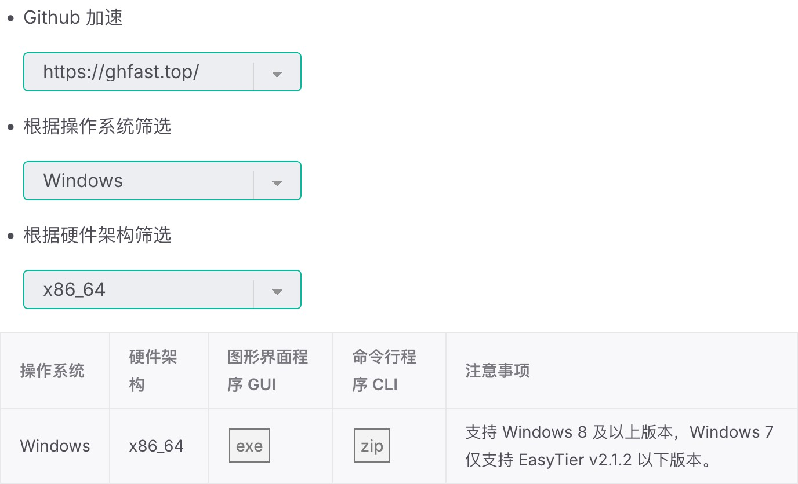
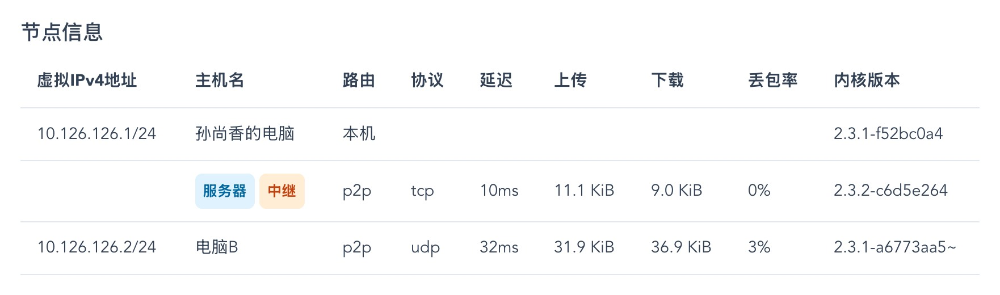

# EasyTier

用于异地组网的工具，可让不同局域网中的设备实现远程互通。

## 一、下载

1.  前往 [最新版本下载地址](https://easytier.cn/guide/download.html#latest)。
2.  在页面中，根据您的 **操作系统** (如 Windows) 和 **硬件架构** (如 x86_64) 筛选列表。为提高下载速度，建议勾选 `Github 加速`。
3.  选择 **图形化界面 (GUI)** 的安装包进行下载。

点击查看下载筛选示例

> 

## 二、配置

打开软件，参考下图完成配置。配置右上角的 **设置** 按钮可以换成中文界面。

### 基础设置

- **虚拟IPv4地址**: 保持默认的 `DHCP` 勾选状态即可。
- **网络名称**: 自行设置一个网络名称，必须以 `hh-` 开头。
- **网络密码**: 自行设置一个密码。
- **网络方式**:
  1.  选择 `公共服务器`。
  2.  在下方输入框填入 `tcp://easytier.1-h.cc:11010`。
  3.  **重要**: 输入后，务必点击下方列表中出现的相同地址，以确认选择。

点击查看配置示例

> 

### 高级设置

- **监听地址**: 如无特殊需求，建议删除所有默认地址。
- **主机名**: 建议填写一个好记的名称，方便在网络中识别此设备。

## 三、运行

完成所有配置后，点击 **运行网络** 按钮。成功后，您将看到网络中的设备列表（节点信息）。

> 

## 四、使用

组网成功后，您就可以通过分配到的 **虚拟IP地址** 访问网络中的其他设备了。

以上图为例，假设：

- **孙尚香的电脑** 获得的虚拟 IP 是 `10.126.126.1`
- **电脑B** 获得的虚拟 IP 是 `10.126.126.2`

那么，在“孙尚香的电脑”上，就可以直接访问“电脑B”的各种服务，例如远程桌面、文件共享等。

## 重要注意

如果想将多台电脑连接到 **同一个网络**，请确保它们的 **网络名称** 和 **网络密码** 设置得完全一样。
